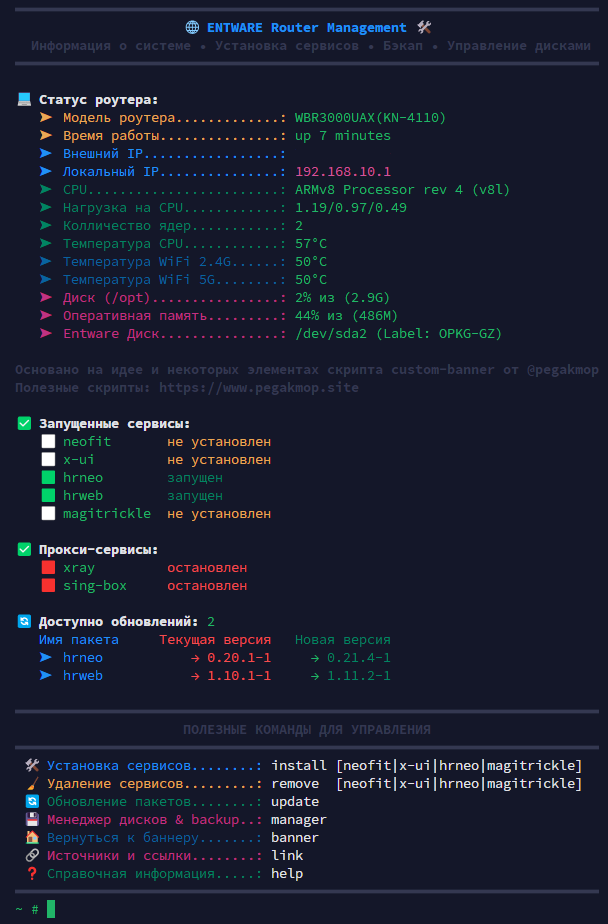
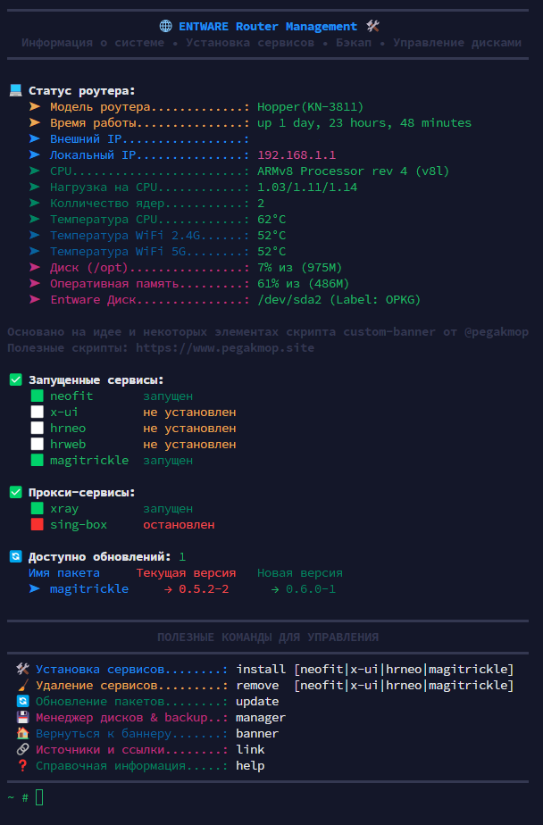

# 🌐 Entware Dashboard для Keenetic


> Универсальный скрипт-дашборд для мониторинга системы и управления **Entware** на роутерах **Keenetic**. Всё управление в одном месте: мониторинг системы, установка сервисов, обновления, управление дисками и полезные ссылки на официальные источники.

---

## 📋 Оглавление

- [Возможности](#-возможности)
- [Установка](#-установка)
- [Использование](#-использование)
- [Скриншоты](#-скриншоты)

## ✨ Возможности
> При запуске отображается наглядная консольная панель со статусом системы:

### 📊 Мониторинг системы
- Информация о модели роутера и времени работы
- Внешний и локальный IP-адреса
- Загрузка CPU, температура процессора и WiFi (2.4G/5G)
- Использование оперативной памяти и диска /opt
- Статус установленных сервисов
- Доступные обновления пакетов

### 🚀 Установка сервисов в один клик
- **neofit** — панель управления прокси
- **x-ui** — 3x-ui панель на роутер
- **hrneo/hrweb** — HydraRoute Neo
- **magitrickle** — управление трафиком

### 🛠️ Управление
- Обновление всех пакетов Entware + автообновление дашборда
- Удаление сервисов с очисткой конфигов
- Менеджер дисков и бэкапов
- Быстрый доступ к официальным источникам

---
## 🚀 Установка
  
Скопируйте и вставьте команду в среде Entware, затем выберите пункт «Установить» и после завершения переподключитесь к терминалу:
```
opkg install curl && curl -L -s "https://raw.githubusercontent.com/LostGit77/ENTWARE-Dashboard/refs/heads/main/install_dashboard.sh" > /tmp/banner.sh && sh /tmp/banner.sh
```
## 🧹 Удаление
  
Скопируйте и вставьте команду в среде Entware, затем выберите пункт «Удалить» и после завершения переподключитесь к терминалу:
```
curl -L -s "https://raw.githubusercontent.com/LostGit77/ENTWARE-Dashboard/refs/heads/main/install_dashboard.sh" > /tmp/banner.sh && sh /tmp/banner.sh
```
---

## 🎯 Использование

После установки скрипт автоматически создаст симлинки в `/opt/bin/`, что позволяет использовать короткие команды:

### Основные команды

| Команда | Описание |
|---------|----------|
| `banner` | Обновить главный экран с мониторингом системы |
| `install [сервис]` | Установить сервис (neofit, x-ui, hrneo, magitrickle) |
| `remove [сервис]` | Удалить сервис с конфигурацией |
| `update` | Обновить пакеты Entware и дашборд |
| `manager` | Запустить менеджер дисков и бэкапов |
| `link` | Быстрый доступ к официальным источникам |
| `help` | Показать справочную информацию |

### Примеры использования

```bash

install neofit - # Установка neofit

install x-ui - # Установка x-ui на роутер

update - # Обновление всех пакетов и дашборда

remove hrneo - # Удаление hrneo
```

## 📸 Скриншоты

### Главный экран (banner)
<p align="center">
  
  
</p>

